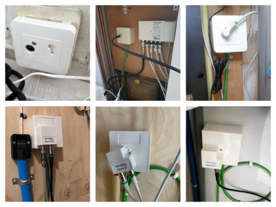

# Few-Shot Object Detection in the ‘Wild’: Detecting Coaxial Cable Splitters, and AOP Wall Socket Plates

__‘I’m not a robot’.__ Ever been asked to label crosswalks in your internet browser to verify you are human? Thanks to
Google’s reCAPTCHA, many of us have. By proceeding with this security check, you protect websites against cyber attacks,
but you also unwittingly contribute to the creation of Google’s annotated image datasets ([Reference](https://support.google.com/recaptcha/answer/6081902?hl=en)).


Figure. 1.  Google’s reCAPTCHA.

Popular computer vision algorithms heavily rely on these kind of datasets. Creating them is often time-consuming, and thus
costly. Especially, in the case of object detection, and instance/semantic segmentation tasks, where the annotator, next
to classifying the object, has to either draw boxes or polygons around the object. Unfortunately, not many companies have
access to efficient data collection systems, such as reCAPTCHA. In order for them to build a successful computer vision
model with limited resources, they have to be creative. 

__Case study__: detecting coaxial cable splitters, and AOP wall socket plates. VodafoneZiggo, a Dutch telecommunications
company, is one of these resourceful companies that seek smart, and innovative computer vision solutions for their customers.
With an ever-expanding image database, VodafoneZiggo seeks for a method that minimizes annotation time.

After an extensive review, a few-shot object detection for meta-learning algorithm called `fsdet` by Wang et al.
was found the most suitable to solve this specific task. Hence, the goal of our study is to apply Wang et al model to a 
real-life dataset with aiming to significantly reduce the number of annotated instances required to detect
coaxial cable splitters, and Abonnee Overname Punten (AOPs) (see Figure 2). 


Figure 2. Examples of coaxial cable splitters, and AOP wall socket plates from our custom dataset.

# Tutorial: Few-Shot Object Detection On Custom COCO-Formatted Dataset

## Part 1. Dataset & Virtual Environment

__Step 1:__ Create an images dataset, and export the annotations in COCO-format. Make sure your train set instances >= the
number of K-shots you want to use for the few-shot model.  

Annotation tool (open source): 
+ CVAT ([Reference](https://github.com/openvinotoolkit/cvat))
+ coco-annotator ([Reference](https://github.com/jsbroks/coco-annotator))

Both of these annotation tools require a basic understanding of Docker. For more information please refer to the
[Docker Starting Guide](https://www.docker.com/get-started)

__Step 2:__ Split your dataset into a train, and test set. A frequently used ratio is 80% for training, and 20% for testing.
A COCO-formatted dataset can easily be split via package called [cocosplit](https://github.com/akarazniewicz/cocosplit). 

__Step 3__: Create, and activate the conda environment:

You can see instruction on how to create and activate the environment on the [README](README.md) file. But for the sake of
saving time, we will add the steps here ass well.

```shell script
conda env create -f environment.yml
conda activate wfsdet
```

After the environment has been created and activated, we have to install the Detectron2 package.
Unfortunately, due to the way the Detectron2 package is setup, `PyTorch` must be already installed. Hence, just adding
Detectron2 to the Conda environment file won't do it for us. Please, to proceed, execute the command below:

```shell script
conda instal -c conda-forge detectron2
``` 

This is enough to get you all the dependencies you need.

__Step 4:__ To prepare novel class instances, run:

```shell script
python -m datasets.prepare_coco_few_shot
``` 

After you have generated the novel class instances transfer the .json files from the `seed 1` folder to the `dataset` folder.

## Part 2. Training Your `wfsdet` Model

__Step 1:__ Open your terminal, and navigate to the ```fsdet-custom``` folder. When you download the package, and store
it in your `home` folder, you can use the following bash command: 

```shell script
cd fsdet-custom
```

To ensure the fsdet-custom package is found, type the following command in your terminal: 

```shell script
export PYTHONPATH=$PYTHONPATH:.
```

__Step 2:__ To train the base classes, type the following bash command in your terminal: 

```shell script
python -m tools.train_net --num-gpus 0 \
        --config-file configs/COCO-detection/faster_rcnn_R_101_FPN_base.yaml
```

You can change the  ```--num-gpus``` to the desired number. When you change this parameter, you have to adjust the model
configurations files accordingly (e.g. batch size etc.)

__Step 3__: For the COCO-formatted dataset, we use novel weights. We first remove the last layer of the base model, then we
tune the predictor on the novel set to install new weights. To execute this step, run:

```shell script
python3 tools/ckpt_surgery.py \
        --src1 checkpoints/coco/faster_rcnn/faster_rcnn_R_101_FPN_base/model_final.pth \
        --method remove \
        --save-dir checkpoints/coco/faster_rcnn/faster_rcnn_R_101_FPN_all1 \
        --coco
```

```shell script
python3 tools/train_net.py --num-gpus 1 \
        --config-file configs/COCO-detection/faster_rcnn_R_101_FPN_ft_novel_1shot.yaml \
        --opts MODEL.WEIGHTS checkpoints/coco/faster_rcnn/faster_rcnn_R_101_FPN_all/model_reset_remove.pth
```

Lastly, we combine the base weights with the novel weights by running the following bash command: 

```shell script
python3 tools/ckpt_surgery.py \
        --src1 checkpoints/coco/faster_rcnn/faster_rcnn_R_101_FPN_base/model_final.pth \
        --src2 checkpoints/coco/faster_rcnn/faster_rcnn_R_101_FPN_ft_novel_1shot/model_final.pth \
        --method combine \
        --save-dir checkpoints/coco/faster_rcnn/faster_rcnn_R_101_FPN_all \
        --coco
```

You can train your model on various K-shot settings. To change the number of shots, adjust the command above. For example,
if you want to use the 10-shot setting change the following line from ```faster_rcnn_R_101_FPN_ft_novel_1shot``` to ```faster_rcnn_R_101_FPN_ft_novel_10shot```. 

__Step 4:__ In this step we fine-tune the last layer of the final model on a balanced dataset. To use the model with the 
regular ‘dot product’ classifier, execute the following bash command:

```shell script
python3 tools/train_net.py --num-gpus 1 \
        --config-file configs/COCO-detection/faster_rcnn_R_101_FPN_ft_fc_all_1shot.yaml \
        --opts MODEL.WEIGHTS checkpoints/coco/faster_rcnn/faster_rcnn_R_101_FPN_all/model_reset_combine.pth
```

Want to use the cosine classifier instead, run:

```shell script
python3 tools/train_net.py --num-gpus 1 \
        --config-file configs/COCO-detection/faster_rcnn_R_101_FPN_ft_all_1shot.yaml \
        --opts MODEL.WEIGHTS checkpoints/coco/faster_rcnn/faster_rcnn_R_101_FPN_all/model_reset_combine.pth
```

For a demo of the model with the regular ‘dot product’ classifier, run the following bash command:

```shell script
python3 demo/demo.py \
        --config-file configs/COCO-detection/faster_rcnn_R_101_FPN_ft_fc_all_1shot.yaml \
        --input input1.jpg input2.jpg \
        --opts MODEL.WEIGHTS checkpoints/coco/faster_rcnn/faster_rcnn_R_101_FPN_ft_fc_all_1shot/model_final.pth
```

Want to run a demo of the cosine classifier, use:

```shell script
python3 demo/demo.py \
        --config-file configs/COCO-detection/faster_rcnn_R_101_FPN_ft_all_1shot.yaml \
        --input input1.jpg input2.jpg \
        --opts MODEL.WEIGHTS checkpoints/coco/faster_rcnn/faster_rcnn_R_101_FPN_ft_all_1shot/model_final.pth
```

For the `--input` option insert image names 

For attribution, please cite as: 

```angular2html
@article{vfz-and-hva,
    title={In-home appliance detection aided by few-shot learning techniques applied to object detection},
    author={van Blerck, I.C.E., Rodrigues, W., Wiggers, P.},
    year={2021}
}
```
